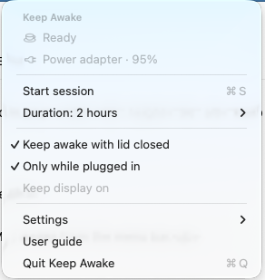

<p align="center">
  
</p>

<h1 align="center">Keep Awake</h1>

<p align="center">Keep your Mac awake from the menu bar.</p>

<p align="center">
  <a href="CHANGELOG.md"></a>
  <a href="#install"></a>
  <a href="#install"></a>
  <a href="#homebrew"></a>
</p>

<p align="center"><a href="#install">Install</a> · <a href="#why-i-built-it">Why I built it</a> · <a href="docs/technical-notes.md">Under the hood</a> · <a href="CHANGELOG.md">Changelog</a></p>

Keep a build, download, or coding agent running while you step away. Click the coffee cup in your menu bar, choose a duration, and start. Stop it when you're done.

<p align="center">
  
</p>

## Why I built it

I wasn't about to pay for a tool to keep my Mac awake when I could build one myself. So I did.

I'm sharing it so you can just use it. No need to pay for one or spend an hour of your life making your own. I've already spent that hour.

## What it does

- Run for a preset duration, set a timer from 1 minute to 24 hours, or keep going until you stop it.
- Let the display turn off while the Mac stays awake, or keep the display on too.
- Use closed-lid mode with administrator approval from macOS for each session.
- Stop when the charger disconnects, at a battery cutoff you choose, or when macOS reports serious thermal pressure.
- Start and stop from a native macOS menu. Launch at login opens the app without starting a session.

Your screen-lock settings stay in effect. Keep Awake doesn't simulate typing or mouse movement.

## Install

**Apple silicon · macOS 14 or later.** The current version is a development candidate. Install through Homebrew below, download the ZIP or DMG from [releases](https://github.com/jaqbec1/KeepAwake/releases), or build locally with Xcode's macOS SDK and Swift compiler.

```sh
git clone https://github.com/jaqbec1/KeepAwake.git
cd KeepAwake
./scripts/package.sh
open "dist/Keep Awake.dmg"
```

Drag **Keep Awake** to Applications, then open it and look for the coffee cup in the menu bar. The build also produces a ZIP in `dist/`.

Local builds are ad hoc signed, not Developer ID signed or notarized. If you're replacing an earlier build, stop its session and quit the app first.

### Homebrew

```sh
brew tap jaqbec1/keepawake https://github.com/jaqbec1/KeepAwake.git
brew install --cask jaqbec1/keepawake/keep-awake
```

For later updates, stop your session and quit Keep Awake, then run:

```sh
brew update
brew upgrade --cask jaqbec1/keepawake/keep-awake
```

To install in your personal Applications folder, add `--appdir="$HOME/Applications"` to the install command. If you already installed it manually, quit that copy and move it aside before installing through Homebrew. Homebrew preserves the app's preferences. This cask uses the same ad hoc signed development build as the release downloads; it does not add notarization.

## Closed-lid mode

Ordinary sessions prevent idle sleep. Closed-lid mode changes a system-wide sleep setting through a helper authorized by macOS. It is designed to restore normal sleep when you stop, the timer expires, or the app exits.

A force-killed helper or an abrupt restart can leave the sleep override enabled. If the app offers **Restore normal sleep**, use it before removing the app. Avoid running another utility that changes the same setting at the same time.

The 1.1.0 candidate has automated checks, but physical lid-close, live restoration, and crash/restart checks are still pending. See the [verification results](docs/verification-1.1.0.md) for completed tests and the [manual checks](docs/verification.md) for what remains.

## Development

```sh
./scripts/build.sh
./scripts/test.sh
```

The default tests don't request administrator approval or change global sleep settings. No package downloads are needed to build the app.

- [Technical notes](docs/technical-notes.md): session behavior, helper design, recovery, and source layout.
- [Changelog](CHANGELOG.md): changes between versions.
- [Report a bug](https://github.com/jaqbec1/KeepAwake/issues): include your macOS version, app version, and what happened. **Copy diagnostics** in the app can help.

## License

A license has not been selected yet.

## Uninstall

Stop the session, turn off **Launch at login**, quit the app, and move it to the Trash. If recovery is shown, restore normal sleep first.
